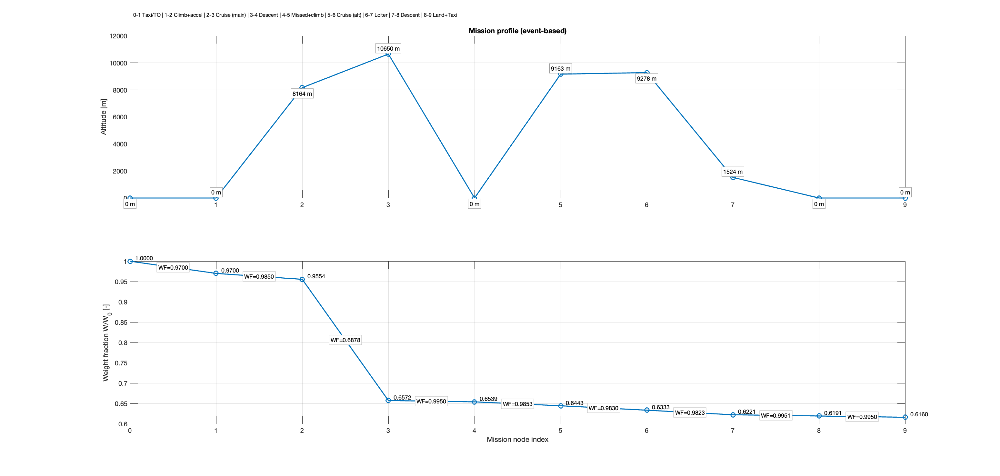

# Aircraft Mission Optimizer  
**Mission Profile Optimisation and Performance Analysis Framework (MATLAB)**  

---

## 1. Overview

The *Aircraft Mission Optimizer* is a modular MATLAB framework for conceptual and preliminary aircraft mission analysis.  
It computes complete mission profiles by coupling aerodynamic modelling, fuel burn estimation, atmospheric properties, and mission performance constraints.

The solver is designed to be:

- **Aircraft-agnostic**: All geometry and performance data are defined by the user.
- **Physics-based**: Cruise altitudes and loiter conditions are solved from lift equilibrium.
- **Modular**: Mission definition, solver logic, plotting, and reporting are separated.
- **Extendable**: New segments, propulsion models, or drag models can be added easily.
- **Research-ready**: Structured outputs allow parametric studies and optimisation.

This framework is well suited for:
- Conceptual aircraft design
- Preliminary performance sizing
- Academic projects
- Mission feasibility studies
- Trade-off and sensitivity analyses  

---

## 2. Mission Model

The mission is discretised into an **event-based sequence**:

| Event Index | Segment Description |
|------------|--------------------|
| 0–1 | Taxi & Take-off |
| 1–2 | Climb and accelerate to cruise |
| 2–3 | Main cruise |
| 3–4 | Descent |
| 4–5 | Missed approach + climb to alternate |
| 5–6 | Alternate cruise |
| 6–7 | Loiter |
| 7–8 | Descent |
| 8–9 | Landing & Taxi |

Each segment is represented by:
- A **configuration state** (gear, flaps, engines)
- A **weight fraction** 
- A drag evaluation at its corresponding flight condition  

Cruise altitudes and loiter Mach numbers are solved.

---
---

## 7. Core Solver Logic

The mission solver follows a deterministic, physics-based iteration scheme that ensures consistency between:
- Aerodynamic performance,
- Aircraft weight evolution,
- Atmospheric conditions,
- Mission constraints.

The workflow is:

1. **Initialisation**
   - Cruise altitudes, lift coefficients, and loiter Mach numbers are initialised from the user guesses defined in `opts`.
   - A seed value of loiter maximum L/D is computed at the loiter altitude.

2. **Cruise Iteration Loop**
   The main loop runs `opts.n_full` times and performs:
   - Evaluation of aerodynamic performance for both cruise segments:
     - Drag coefficient
     - Lift coefficient
     - Lift-to-drag ratio
   - Mission fuel-fraction calculation using the Breguet-style exponential formulation.
   - Update of cruise start and end altitudes by enforcing lift equilibrium.
   - Mean cruise altitudes are updated.

3. **Loiter Mach Convergence**
   Two independent loops converge:
   - Start loiter Mach number
   - End loiter Mach number  


4. **Fuel Closure**
   From all candidate mission solutions, the solver selects the index that minimises, guaranteeing that the mission is feasible within fuel capacity.

5. **Post-Processing**
   - L/D consistency is checked by comparing:
     - Direct drag model
     - Optimal L/D solver
   - Convergence errors are stored for validation.

---

## 6. Output Structure

The mission solver returns a single structured variable named `out`.  
This structure is the primary interface between the numerical core and all post-processing, reporting, and plotting utilities.

It is intentionally divided into three independent blocks:

- `out.solution`
- `out.vectors`
- `out.diagnostics`

This separation provides:
- A clean and compact final solution (`out.solution`)
- Full access to all candidate solutions (`out.vectors`)
- Quantitative validation of solver convergence and physical consistency (`out.diagnostics`)

### `out.solution` — Final Mission Solution

This structure contains the final, fuel-closed mission configuration selected by the solver.  
The chosen index minimises:


Fields:
- `idx`: index of selected candidate
- `R_main`: solved main range [m]
- `hcruise_start`, `hcruise_end`: cruise 1 start/end altitude [m]
- `hcruise2_start`, `hcruise2_end`: cruise 2 start/end altitude [m]
- `mean_h1`, `mean_h2`: mean cruise altitudes [m]
- `CL1`, `CL2`: cruise lift coefficients [-]
- `M_loi_1`, `M_loi_2`: loiter Mach start/end [-]
- `CL3`, `CL4`: loiter lift coefficients start/end [-]
- `LDmax_loi`, `LDmax_loi_2`: loiter max L/D start/end [-]
- `W1cruise`, `W2cruise`, `Wloiter`: segment weight fractions [-]
- `a_loi`: speed of sound at loiter altitude [m/s]

### `out.vectors` — Candidate Solution Vectors

Stores candidate solution arrays used for fuel-closure selection and debugging.

Fields:
- `h1s`, `h1e`, `h2s`, `h2e`: candidate cruise altitudes [m]
- `W1_vec`, `W2_vec`, `Wloi_vec`: candidate segment fractions [-]
- `Wf_Wo`: fuel fraction required [-]
- `Wf_Wo_real`: fuel fraction available [-]

### `out.diagnostics` — Solver Health and Consistency Metrics

Quantitative convergence and consistency indicators.

Fields:
- `h1_diff_pct`, `h2_diff_pct`: last-iteration cruise altitude change [%]
- `M_loi_diff_start_pct`, `M_loi_diff_end_pct`: last-iteration loiter Mach change [%]
- `LD_diffs_pct`: L/D consistency deltas [%]

---

## 7. What the User Should Modify

Only modify:

- `make_const_params.m` — aircraft geometry and model constants
- `mission` struct — mission definition (weights, Mach numbers, loiter settings)
- `opts` struct — solver settings (iterations, initial guesses)
- `cfg` struct — configuration flags (engine, gear, flaps)

---

## 8. Intended Use

This framework is designed for:
- Conceptual aircraft design
- Mission feasibility studies
- Trade studies (Mach, altitude, payload, fuel)
- Academic coursework and research

It is **not** intended for certification-level performance prediction.

## Drag Model References

The drag formulation implemented in this repository follows standard conceptual aircraft design methodologies.  
It combines parasite drag build-up, induced drag, wave drag, miscellaneous drag and Oswald efficiency corrections using semi-empirical correlations widely accepted in aerospace engineering.

All aerodynamic models implemented in the `Aerodynamics/` folder are based on the same references used in the performance and drag analysis section of the conceptual design report.

---

### Primary References

1. **Raymer, D. P.**  
   *Aircraft Design: A Conceptual Approach*, 6th Edition, AIAA Education Series, 2018.  

   Used for:
   - Parasite drag build-up methodology  
   - Skin friction coefficient correlations  
   - Form factors for wings, fuselage and nacelles  
   - Miscellaneous drag models (gear, flaps, upsweep)  
   - Induced drag formulation  
   - Cruise and loiter fuel fraction models  
   - Mission segment weight fraction modelling  

---

2. **Hoerner, S. F.**  
   *Fluid-Dynamic Drag*, Hoerner Fluid Dynamics, 1965.  

   Used for:
   - Detailed component drag estimation  
   - Body, nacelle and landing gear drag coefficients  
   - Form factor validation  
   - Interference drag corrections  

---

3. **Roskam, J.**  
   *Airplane Design – Part VI: Preliminary Calculation of Aerodynamic, Thrust and Power Characteristics*,  
   DARcorporation, 1985.  

   Used for:
   - Parasite drag decomposition  
   - Wetted area methods  
   - Interference factors  
   - High-lift device drag increments  
   - Undercarriage drag estimation  

---

4. **Torenbeek, E.**  
   *Synthesis of Subsonic Airplane Design*, Delft University Press, 1982.  

   Used for:
   - Induced drag efficiency modelling  
   - Fuselage-wing interference effects  
   - Lift-dependent drag correlations  

---

5. **Anderson, J. D.**  
   *Introduction to Flight*, 8th Edition, McGraw-Hill, 2015.  

   Used for:
   - Lift equilibrium relations  
   - Standard aerodynamic force formulation  
   - Mach number, speed of sound and dynamic pressure relations  

---

6. **International Standard Atmosphere (ISA)**  
   ICAO Standard Atmosphere Model  

   Used for:
   - Density variation with altitude  
   - Speed of sound variation  
   - Temperature and pressure profiles  
   Implemented in:
   ```text
   Atmosphere/isa_atm.m
---
7. **Scholz, D.**  
   *Oswald Efficiency Number – Method Only*, Hamburg University of Applied Sciences, 2010.  
   Available at:  
   https://www.fzt.haw-hamburg.de/pers/Scholz/OPerA/OPerA_PRE_DLRK_12-09-10_MethodOnly.pdf  
   Accessed: 2025-11-15  

   Used for:
   - Oswald efficiency factor formulation  
   - Wing–fuselage interference corrections  
   - Aspect ratio, taper ratio and sweep influence on efficiency  
   - Validation of induced drag efficiency modelling  

---

### Updated Mapping to Code

| Model Component | Implemented In | Reference |
|----------------|---------------|---------|
| Skin friction coefficient | `Cf_find.m` | Raymer, Hoerner |
| Form factors | `FF_finder.m` | Raymer, Hoerner |
| Parasite drag build-up | `DragFinder.m` `LDMetircSolver.m` | Raymer, Roskam |
| Induced drag | `DragFinder.m` LDMetircSolver.m`| Raymer, Torenbeek |
| Oswald efficiency  | `make_const_params.m` | Scholz |
| Miscellaneous drag | `miss_drag.m` | Raymer, Hoerner |
| High-lift drag increments | `miss_drag.m` | Roskam |
| Wave drag / compressibility | `DragFinder.m` LDMetircSolver.m` | Raymer |
| Optimal L/D solver | `LDMetircSolver.m`.m` | Raymer |
| Lift equilibrium solver | `CL_find_h.m` | Anderson |
| Atmosphere model | `isa_atm.m` | ICAO ISA |

---

---

## Example Output

### Mission Profile Plot

The solver produces an event-based mission profile with:

- **Altitude vs mission node index**
- **Cumulative weight fraction (W/W0) vs mission node index**, with per-segment weight fractions annotated



---

### Console Summary (Example)

```text
============================================================
                 MISSION SOLUTION SUMMARY
============================================================

-- Mission inputs --
Cruise 1 Mach: 0.780 | Cruise 2 Mach: 0.660
Alternate cruise distance (R_alt): 370 km
Loiter: 45 min at 1524 m

-- Solved cruise altitudes --
Cruise 1: start 8164 m -> end 10650 m (mean 9407 m)
Cruise 2: start 9163 m -> end 9278 m (mean 9221 m)

-- Aerodynamics --
CL cruise1: 0.365 | CL cruise2: 0.398
Loiter CL: start 0.712 | end 0.712
Loiter L/Dmax: start 17.003 | end 17.002

-- Segment weight fractions (W_after/W_before) --
Warmup: 0.9700 | Climb1: 0.9850 | Cruise1: 0.6878 | Decel: 0.9950 | Cruise2: 0.9830 | Loiter: 0.9823 | Land: 0.9950

-- Range / fuel closure --
Main range solved: 9151 km
Fuel fraction used:  0.38783
Fuel fraction avail: 0.38783
Fuel fraction margin: -0.00000
Fuel used: 34520 kg | Fuel cap: 36451 kg | Margin: 1932 kg

-- Diagnostics --
Cruise altitude convergence (last iter): h1 -0.000 % | h2 -0.000 %
Loiter Mach convergence (last iter): start -0.000 % | end -0.000 %
L/D consistency (vs CD_total_f3):
  Cruise1 start 0.383 % | end -0.401 %
  Cruise2 start 0.018 % | end -0.018 %

Loiter speed: start 111.0 m/s | end 111.0 m/s
============================================================

          Segment           Weight_N     Weight_kg
    ___________________    __________    _________

    "W0"                   9.1068e+05      92864
    "After warm+climb1"    8.7011e+05      88726
    "After cruise1"        5.9848e+05      61028
    "After decel"          5.9549e+05      60723
    "After cruise2"        5.8538e+05      59693
    "After loiter"         5.7503e+05      58637
    "After land"           5.7216e+05      58344

         Point         Altitude_m
    _______________    __________

    "Cruise1 start"      8164.1
    "Cruise1 end"         10650
    "Cruise2 start"      9163.5
    "Cruise2 end"        9277.8
    "Loiter"               1524
```
## License

This project is released under an **Imperial College London – Student Academic License**.

It is intended for:
- Academic use  
- Educational projects  
- Coursework and research  
- Conceptual and preliminary aircraft design studies  

You are free to:
- Use the code
- Modify the code
- Extend the code
- Run simulations and analyses
- Include results in academic reports and theses  

Under the following conditions:
- Proper attribution must be given to the original author
- The code must not be sold or used in commercial products
- The code must not be used for certification or industrial design approval
- Any derivative work must clearly reference this repository

Suggested citation format:
```text
Cabrer Falomir, B. (2026). Aircraft Mission Optimizer.  
Imperial College London – Department of Aeronautics.  
GitHub repository: https://github.com/TomyCabrer/AircraftMissionOptimizer
